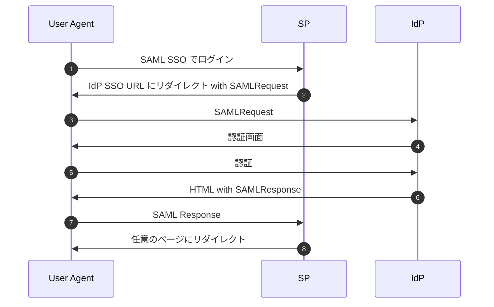

:::message
この記事は SAML 認証について書かれた記事ですが、私自身 SAML 認証に詳しいわけではありません。もし誤りや不備がありましたら、コメントいただけると嬉しいです。
:::

# はじめに
SAML 認証の学習を始めるにあたり、[SAML入門](https://introduction-to-saml.tumblr.com/)が非常に分かりやすくオススメです。しかし、実際に実装するときにつまづくポイントがあったので、この記事でそれらをまとめました。今回は以下のトピックに触れていきます。

- IdP の証明書の信頼
- SAMLResponse 受信時の Cookie
- IdP-initiated の CSRF 対策
- Single Logout の仕様
- Single Logout 実装の必要性

# IdP の証明書の信頼
まずは、IdP の証明書の信頼についてです。SAML 認証を始めるにあたって、IdP の証明書を SP に登録します。このときに IdP の証明書を信頼していいものなのかどうか悩みました。

TLS だと、証明書が認証局によって署名されたものかどうかを検証していくことになるかと思うのですが、SAML 認証でも同じようなフローが必要なのかどうか、よくわかりませんでした。

これに対してどう対応するのかは仕様からはみつけられませんでしたが、証明書の扱い方に関して言及しているサイト（[PingIdentity](https://support.pingidentity.com/s/article/Do-I-need-a-trusted-CA-signed-certificate-for-SAML-signatures)）がありました。

この記事によると、TLS と SAML は異なる信頼モデルであり、アップロードされた証明書のみを信頼するとよい、と書かれています。このようにすることで、自己署名証明書も使うことができます。

一方で、認証局が署名した証明書を使うメリットもあります。 パートナーが証明書チェーンを検証する場合、SAMLResponse などに現在の証明書を含めることができ、それを使って署名の検証を行うことができます。こうすることで、証明書の期限を気にする必要はなくなります。

このあたりは IdP 次第だと思うので、はじめは SP はアップロードされた IdP の証明書のみを信頼する運用で問題はないかと思います。

# SAMLResponse 受信時の Cookie
つぎに、SAMLResponse 受信時の Cookie についてです。以下のシーケンス図の7番で送られる SAMLResponse に InResponseTo が含まれますが、SP はこれを検証する必要があります。このとき、クロスオリジンであるため、 Cookie は送られないものだと勘違いしてしまいました。実際には、[単純リクエスト](https://developer.mozilla.org/ja/docs/Web/HTTP/CORS#%E5%8D%98%E7%B4%94%E3%83%AA%E3%82%AF%E3%82%A8%E3%82%B9%E3%83%88)に相当するため、 Cookie も送信されます。




IdP からユーザーエージェントに返却したレスポンスは、おおよそ以下のようなイメージとなっており、 JavaScript で form 要素の submit を実行しています。これは単純リクエストの条件を満たすため、 Cookie は送信されます。

したがって、シーケンス図の2番で SAMLRequest を作成する時に Request の ID をセッションを利用して保存しておくことで、 SP は SAMLResponse を受け取った時に Request の ID と InResponseTo を比較することができます。

ここを勘違いしてしまったせいで、実装をはじめた当初は KVS に Request の ID を格納する、という少し回りくどい方法をとってしまいました。

```html
<form name="samlform">
	<input name="SAMLResponse" value="...">
	<input name="RelayState" value="...">
</form>

<script>
	document.samlform.submit();
</script>
```

# IdP-initiated の CSRF 対策
InResponseTo は CSRF 対策として機能しています。しかし、 IdP-initiated では InResponseTo が存在しないので、CSRF 対策ができません。この問題は [ritou さんの記事](https://zenn.dev/ritou/articles/9366cc534860e5)でも指摘されており、ちょっと SAML 微妙だなと思ってしまう要素の1つです。

この対策はとくに仕様に書かれてはなさそうだったため、こういったリスクがあることを念頭に入れておくのは重要なのかなと思います。

# Single Logout の仕様
Single Logout は、仕様では以下のようなシーケンス図で表されています。

SP-initiated の場合は、1番から開始し、他にも SAML 認証している SP がある場合は、3番と4番を繰り返していきます。

IdP-initiated の場合は、3番から開始し、他にも SAML 認証している SP がある場合は、3番と4番を繰り返していきます。

ここで難しかったポイントは、 LogoutRequest/LogoutResponse の送り方と署名の2つになります。

（[SAML Profile](http://docs.oasis-open.org/security/saml/v2.0/saml-profiles-2.0-os.pdf) 4.4.2 Profile Overview, Figure 3 より引用）


## LogoutRequest/LogoutResponse の送り方

### SP-initiated で LogoutRequest を送るとき
SP-initiated の LogoutRequest を送る場合は、仕様には以下のように書かれています。

（[SAML Profile](http://docs.oasis-open.org/security/saml/v2.0/saml-profiles-2.0-os.pdf) 4.4.2 Profile Overview, 1171 行目）
> The request may be sent directly to the identity provider or sent indirectly through the user agent.

つまり、直接 IdP に LogoutRequest を送っても良いし、ユーザーエージェント経由で送ってもいい、ということになります。このとき、SAMLRequest を送る時と同じく、 HTTP POST Binding や HTTP Redirect Binding といった Binding に従って送信します。

### IdP から LogoutRequest を受け取って LogoutResponse を返すとき
IdP から LogoutRequest を受け取る場合は、仕様には以下のように書かれています。

（[SAML Profile](http://docs.oasis-open.org/security/saml/v2.0/saml-profiles-2.0-os.pdf) 4.4.2 Profile Overview, 1186 行目）
> The response may be returned directly to the identity provider or indirectly through the user agent (if consistent with the form of the request in step 3).

これは LogoutRequest を受け取った方法と同じ方法で LogoutResponse を返してね、ということになります。このハンドリングはなかなか複雑に感じます。

また、ここで SP が正しく振る舞っていない場合やエラーが発生した場合、 Single Logout のプロセス全体が失敗してしまい、他の SP はセッションが破棄されない、というリスクがあります。このことに関しては、[SAML2P Documentation](https://www.identityserver.com/documentation/saml2p/config-idp/idp-initiated-slo/)で少し触れられています。

## 署名
LogoutRequest/LogoutResoponse の両方とも署名は必須になります。そのため、 Single Logout に対応する場合、 SP は署名用の秘密鍵を管理し、署名検証用の証明書を IdP に登録する必要があります。

# Single Logout 実装の必要性
Single Logout を利用することで、他にも SAML 認証している SP が存在する場合は、それらのセッションも破棄することができます。しかし、SAML を実装しているプロダクトのヘルプを探してみても、 SP の証明書を IdP に登録したり、Single Logout URL を IdP に設定したりするように促しているプロダクトはほとんどみつからなかったため、そもそも Single Logout に対応するのが一般的なのかどうかも分からなくなってきました。

さらにいろいろなプロダクトのヘルプをみていくと、IdP でユーザーを非アクティブ化するときは、 SCIM（[Salesforce](https://help.salesforce.com/s/articleView?id=sf.identity_scim_deactivate_reactivate_user.htm&type=5), [Udemy](https://business-support.udemy.com/hc/ja/articles/360035200594-SCIM%E3%81%A7%E3%83%A6%E3%83%BC%E3%82%B6%E3%83%BC%E3%81%A8%E3%82%B0%E3%83%AB%E3%83%BC%E3%83%97%E3%81%AE%E7%AE%A1%E7%90%86%E3%82%92%E8%87%AA%E5%8B%95%E5%8C%96%E3%81%99%E3%82%8B%E6%96%B9%E6%B3%95), ...） を利用しているケースが多くみられました。

したがって、Single Logout は実装しなくてもいいのでは？　というのが今の自分の意見になります。SAML で実現するのは SSO のみで、Single Logout によるセッション破棄は行わない。そしてアカウントの非アクティブ化などのアカウント管理は SCIM で行うようなイメージになるのかなと思います。（あくまで私個人の意見になります。一般的にはこうだよ、というのがあればコメントいただけると嬉しいです）

# さいごに
いまいちまとまってはいないですが、SAML入門を読むだけでは分からなかったことを記事にしてみました。まだまだ SAML 認証の理解が浅いので、ご意見ある方いらっしゃいましたらコメントいただけると嬉しいです。

また、SAML 認証を学ぶにあたって、Golang で実際に実装してみました。いろいろと不備はあるかと思いますが、多少参考になる部分があるかもです。
https://github.com/ksrnnb/saml-impl

# 参考文献
SAML を実装しているプロダクトのヘルプが意外と役に立ちました。

- [SmartHR ヘルプセンター](https://support.smarthr.jp/ja/help/sections/360005759054/)
  - SmartHR は SP-initiated の Single Logout に対応している
- [Chartwork 管理者設定ご利用ガイド](https://download.chatwork.com/Chatwork_AdminGuide.pdf)
  - 「16-1.SAML認証によるシングルサインオン設定について」 
- [cybozu.com ヘルプ](https://jp.cybozu.help/general/ja/admin/list_saml.html)
- [board ヘルプセンター](https://the-board.jp/helps/help_saml_sso_okta)

- [ペンティオヘルプセンター](https://support.onelogin.jp/hc/ja/articles/900003409326-Salesforce-SAML%E8%AA%8D%E8%A8%BC)