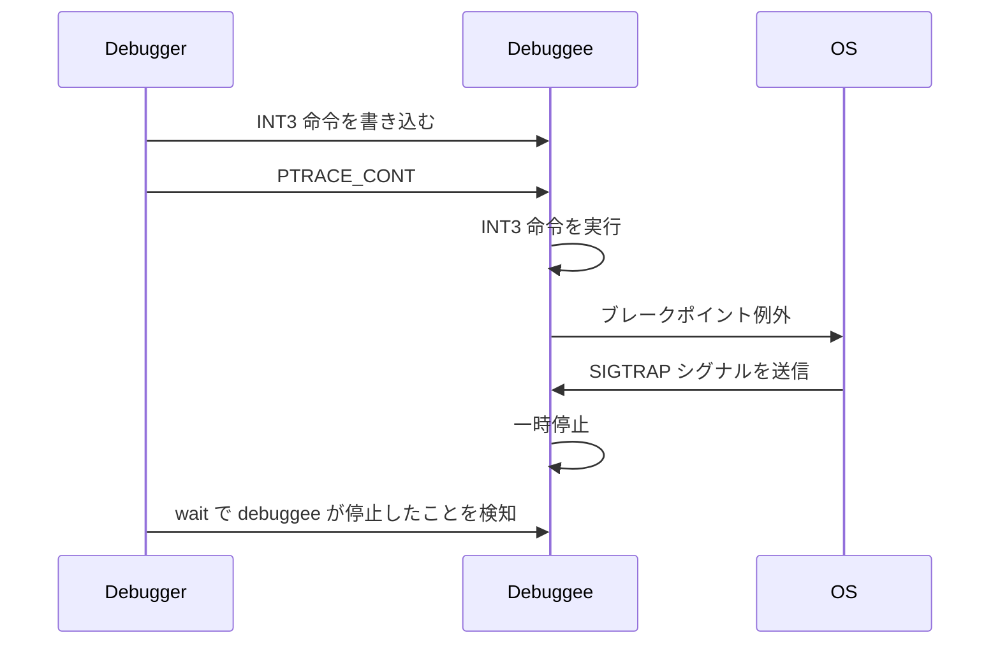

# 特定のメモリアドレスにブレークポイントを設定する
みなさんがデバッガを使う時は、特定のファイルの特定の行にブレークポイントを設定すると思いますが、いきなりそれを実装するのはハードルが高いので、まずは特定のメモリアドレスにブレークポイントを設定できるようにしていきます。

## ファイルの追加
debugger ディレクトリ配下に、 breapoint.go を作成します。
```diff
go-debugger/
  └── debugger
+    ├── breakpoint.go
     └── debugger.go
```

## breakpoint.go の実装
さっそくブレークポイントの実装をしていきます。
Breakpoint 構造体はプロセス ID と、ブレークポイントを設定するメモリアドレス、ブレークポイントを設定する前の命令の情報を持っています。

```go:go-debugger/debuger/breakpoint.go
package debugger

import (
	"encoding/binary"
	"syscall"
)

const Int3Instruction = 0xcc

type Breakpoint struct {
	pid                 int
	addr                uintptr
	originalInstruction []byte
	isEnabled           bool
}

func NewBreakpoint(pid int, addr uintptr) (*Breakpoint, error) {
	// originalInstruction must be allocated 8 bytes buffer to execute PtracePeekData
	bp := &Breakpoint{pid: pid, addr: addr, originalInstruction: make([]byte, 8)}
	if err := bp.Enable(); err != nil {
		return nil, err
	}

	return bp, nil
}
```

ブレークポイントを設定する時は Enable メソッドを呼びます。ここでは PtracePeekData 関数でオリジナルの命令を保持しておき、先頭1バイトを INT3 命令に置き換えたものを PtracePokeData で書き込みます。
INT3 命令の詳細については後述しますが、この命令が実行されると debuggee は一時停止します。

```go:go-debugger/debuger/breakpoint.go
// Enable reads the instruction at the address of the breakpoint and rewrites it to an INT3 instruction.
func (bp *Breakpoint) Enable() error {
	_, err := syscall.PtracePeekData(bp.pid, bp.addr, bp.originalInstruction)
	if err != nil {
		return err
	}

	data := binary.LittleEndian.Uint64(bp.originalInstruction)
	// data & ^uint64(0xff) => data & 11111111 11111111 11111111 11111111 11111111 11111111 11111111 00000000
	newData := (data & ^uint64(0xff)) | Int3Instruction
	newInstruction := make([]byte, 8)
	binary.LittleEndian.PutUint64(newInstruction, newData)

	_, err = syscall.PtracePokeData(bp.pid, bp.addr, newInstruction)
	if err != nil {
		return err
	}

	bp.isEnabled = true
	return nil
}

func (bp *Breakpoint) IsEnabled() bool {
	return bp.isEnabled
}
```


## debugger.go の更新
メモリアドレスをキー,  Breakpoint を値とする map を Debugger が持つようにします。
```diff:go-debugger/debugger/debugger.go
type Debugger struct {
	config      *Config
	pid         int
+	breakpoints map[uint64]*Breakpoint
}
```

Debugger 初期化時に、 Breakpoint の map も初期化しておきます。

```diff:go-debugger/debugger/debugger.go
func NewDebugger(config *Config) (*Debugger, error) {
-	d := &Debugger{config: config}
+	d := &Debugger{
+		config:      config,
+		breakpoints: make(map[uint64]*Breakpoint),
+	}
	if err := d.Launch(); err != nil {
		return nil, err
	}

	return d, nil
}
```

ブレークポイントを設定するコードは以下になります。 Breakpoint を初期化して、 breakpoints の map に追加します。

```diff:go-debugger/debugger/debugger.go
func (d *Debugger) Quit() error {
	...
}

+ func (d *Debugger) SetBreakpoint(addr uint64) error {
+	bp, err := NewBreakpoint(d.pid, uintptr(addr))
+	if err != nil {
+		return err
+	}
+
+	d.breakpoints[addr] = bp
+
+	return nil
+ }
```

debuggee が INT3 命令を実行すると SIGTRAP シグナルを受信して一時停止するので、その場合はブレークポイントにヒットしたということを出力するようにします。

```diff:go-debugger/debugger/debugger.go
func (d *Debugger) Continue() error {
	...

	if ws.Exited() {
		return ErrDebuggeeFinished
	}

+	if ws.Stopped() {
+		switch ws.StopSignal() {
+		case syscall.SIGTRAP:
+			fmt.Println("hit breakpoint!")
+		default:
+			// ignore SIGURG signal because it is not expected signal
+			return d.Continue()
+		}
+	}

-	// ignore SIGURG signal because it is not expected signal
-	if ws.Stopped() && ws.StopSignal() == syscall.SIGURG {
-		return d.Continue()
-	}

	return nil
}
```

## command.go の更新
ブレークポイントを設定するコードが実装できたので、コマンドから呼べるようにします。

```diff:go-debugger/debugger/command.go
func NewCommands() *Commands {
	return &Commands{
		cmds: []command{
			{
				aliases: []string{"continue", "c"},
				cmdFn:   cont,
			},
			{
				aliases: []string{"quit", "q"},
				cmdFn:   quit,
			},
+			{
+				aliases: []string{"break", "b"},
+				cmdFn:   setBreakpoint,
+			},
		},
	}
}
```

setBreakpoint の実装は以下のようになります。引数のバリデーションを行ってからブレークポイントの設定の処理を実行するようにします。

```diff:go-debugger/debugger/command.go
func quit(dbg *debugger.Debugger, args []string) error {
	return dbg.Quit()
}

+ func setBreakpoint(dbg *debugger.Debugger, args []string) error {
+	if len(args) == 0 {
+		return errors.New("length of args must be greater than 0")
+	}
+
+	addr, err := strconv.ParseUint(args[0], 16, 64)
+	if err != nil {
+		return errors.New("breakpoint address must be parsed as uint64")
+	}
+
+	return dbg.SetBreakpoint(addr)
+ }
```

# ブレークポイントの動作確認
もう少し実装すべき箇所はありますが、いったん動作を確認してみましょう。

## ビルド
まずは helloworld プログラムをビルドしておきます。
```bash
go build -o helloworld.o -gcflags "all=-N -l" ./cmd/helloworld/
```

## objdump
どのメモリアドレスにブレークポイントを設定するか調べるために、 objdump コマンドを利用します。インストールされていない場合は、下記コマンドでインストールしておきます。

```bash
sudo apt install -y binutils
```

出力が長すぎるので適当なファイルに書き込みます。

```bash
objdump -d helloworld.o -M intel > tmp
```

tail コマンドで一部を出力した結果が以下になります。
まず、 main.main というシンボル名が見つかるかと思います。これが main パッケージの main 関数を表します。その中で、 `call <address> <fmt.Println>` が実行されており、ここで Hello, World! が出力されます。
今回は call 命令のメモリアドレス `4ae618` にブレークポイントを設定してみましょう。（これを実装しているみなさんはアドレスの値が異なるかと思いますので、適宜変更してください）

```bash
tail -50 tmp

#00000000004ae5a0 <main.main>:
#  4ae5a0:       49 3b 66 10             cmp    rsp,QWORD PTR [r14+0x10]
#  4ae5a4:       76 7d                   jbe    4ae623 <main.main+0x83>
#  ...
#  4ae618:       e8 e3 ae ff ff          call   4a9500 <fmt.Println>
#  4ae61d:       48 83 c4 48             add    rsp,0x48
#  ...
#  4ae628:       e9 73 ff ff ff          jmp    4ae5a0 <main.main>
```

## ブレークポイントの設定
`4ae618` にブレークポイントを設定して continue してみると、ブレークポイントにヒットしますが、それ以降の処理がうまくいってなさそうです。次はこれを修正していきます。

```bash
go run . -path ./cmd/helloworld/

# go-debugger> b 4ae618
# 
# go-debugger> c
# hit breakpoint!
# 
# go-debugger> c
# failed to run terminal: faield to execute ptrace cont: no such processSIGILL: illegal instruction
# PC=0x4ae61b m=0 sigcode=2
# instruction bytes: 0xff 0xff 0x48 0x83 0xc4 0x48 0x5d 0xc3 0xe8 0x18 0x3e 0xfc 0xff 0xe9 0x73 0xff
# ...
```


# no such process の対応

## no such process が発生する原因

`no such process` のエラーが出ていたのでその原因を探っていきます。まず、 main 実行前に、プロセス ID とスレッド ID を出力しておきます。

```diff:go-debugger/main.go
func init() {
	flag.StringVar(&debuggeePath, "path", "", "path of debuggee program")
+	fmt.Printf("start process id: %d\n", syscall.Getpid())
+	fmt.Printf("start thread id: %d\n", syscall.Gettid())
}
```

エラーが発生した時も同じく、プロセス ID とスレッド ID を出力しておきます。

```diff:go-debugger/terminal/terminal.go
if err := cmdFn(t.debugger, args); err != nil {
	if errors.Is(err, debugger.ErrDebuggeeFinished) {
		break
	}
+	fmt.Printf("Error on process id: %d\n", syscall.Getpid())
+	fmt.Printf("Error on thread id: %d\n", syscall.Gettid())
	return err
}
```

この状態で実行してみます。すると、エラーが起きた時にはプログラム開始時とスレッド ID が異なっていることが分かります。 PTRACE_TRACEME を実行したときのスレッドと異なる場合は ptrace が実行できないので `no such process` というエラーが発生していました。

```bash
go run . -path ./cmd/helloworld/

# start process id: 44784
# start thread id: 44784
# go-debugger> b 4ae618

# go-debugger> c
# hit breakpoint!

# go-debugger> c
# Error on process id: 44784
# Error on thread id: 44788
# failed to run terminal: faield to execute ptrace cont: no such processSIGILL: illegal instruction
```

そもそも、なぜスレッド ID が異なるのかというと、 Go のランタイムがそのように実装されているためです。
ゴルーチンはいつも同じスレッドで実行されるわけではなく、異なるスレッドで実行されるようにスケジューリングされることもあります。Go ランタイムの挙動に関しては、 さき(H.Saki) さん著の[『Goでの並行処理を徹底解剖！』](https://zenn.dev/hsaki/books/golang-concurrency/viewer/gointernal)の解説が分かりやすいので参考にしてみてください。

## no such process の修正
Go ランタイムの仕様でゴルーチンが実行されるスレッドは変化しますが、これは [runtime.LockOSThread](https://pkg.go.dev/runtime@go1.23.2#LockOSThread) を実行することで固定することができます。この関数を実行すると、呼び出し元のゴルーチンを常に現在の OS スレッドで実行します。

それではコードを修正してみましょう。

```diff:go-debugger/main.go
```diff:go-debugger/main.go
func init() {
+	runtime.LockOSThread()
+
	flag.StringVar(&debuggeePath, "path", "", "path of debuggee program")
-	fmt.Printf("start process id: %d\n", syscall.Getpid())
-	fmt.Printf("start thread id: %d\n", syscall.Gettid())
}
```

```diff:go-debugger/terminal/terminal.go
if err := cmdFn(t.debugger, args); err != nil {
	if errors.Is(err, debugger.ErrDebuggeeFinished) {
		break
	}
-	fmt.Printf("Error on process id: %d\n", syscall.Getpid())
-	fmt.Printf("Error on thread id: %d\n", syscall.Gettid())
	return err
}
```

この状態で実行してみます。ブレークポイントにヒットした後に再度 continue すると処理が停止してしまいます。 Ctrl + C で処理を中断すると、 illegal instruction というエラーが発生していることがわかります。これは INT3 命令に書き換えたあと、元に戻さずにそのまま実行を続けようとしているためです。この次章で修正していきます。

```bash
go run . -path ./cmd/helloworld/

# go-debugger> b 4ae618                  

# go-debugger> c
# hit breakpoint!

# go-debugger> c
# ^Csignal: interrupt
# SIGILL: illegal instruction
```

# INT3 命令
最後に、 INT3 命令について解説しておきます。今回、命令の先頭1バイトを INT3 命令に置き換えることで、ブレークポイントを実装しました。 INT3 命令は x86-64 アーキテクチャにおける CPU 命令の一つで、ブレークポイント例外を発生させます。ブレークポイント例外の詳細は [Intel® 64 and IA-32 Architectures Software Developer Manuals](https://www.intel.com/content/www/us/en/developer/articles/technical/intel-sdm.html#three-volume#three-volume) の Volume 3A の `7.15 EXCEPTION AND INTERRUPT REFERENCE` に記載があります。
このブレークポイント例外を OS が捕捉し、 SIGTRAP シグナルを debuggee に送信します。 debuggee は SIGTRAP シグナルを受信すると一時停止するので、 debugger は `unix.Wait4` 関数で debuggee が INT3 命令によって一時停止したことを知ることができます。
この流れをまとめたのが以下の図になります。



