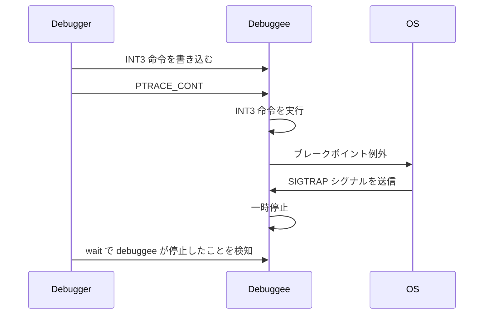

# 特定のメモリアドレスにブレークポイントを設定する
みなさんがデバッガを使う時は、特定のファイルの特定の行にブレークポイントを設定すると思いますが、いきなりそれを実装するのはハードルが高いので、まずは特定のメモリアドレスにブレークポイントを設定できるようにしていきます。

## ファイルの追加
debugger ディレクトリ配下に、 breapoint.go を作成します。
```diff
go-debugger/
  └── debugger
+    ├── breakpoint.go
     └── debugger.go
```

## breakpoint.go の実装
さっそくブレークポイントの実装をしていきます。
Breakpoint 構造体はプロセス ID と、ブレークポイントを設定するメモリアドレス、ブレークポイントを設定する前の命令の情報を持っています。

```go:go-debugger/debuger/breakpoint.go
package debugger

import (
	"encoding/binary"
	"syscall"
)

const Int3Instruction = 0xcc

type Breakpoint struct {
	pid                 int
	addr                uintptr
	originalInstruction []byte
	isEnabled           bool
}

func NewBreakpoint(pid int, addr uintptr) (*Breakpoint, error) {
	// originalInstruction must be allocated 8 bytes buffer to execute PtracePeekData
	bp := &Breakpoint{pid: pid, addr: addr, originalInstruction: make([]byte, 8)}
	if err := bp.Enable(); err != nil {
		return nil, err
	}

	return bp, nil
}
```

ブレークポイントを設定する時は Enable メソッドを呼びます。ここでは PtracePeekData 関数でオリジナルの命令を保持しておき、先頭1バイトを INT3 命令に置き換えたものを PtracePokeData で書き込みます。
INT3 命令の詳細については後述しますが、この命令が実行されると debuggee は一時停止します。

```go:go-debugger/debuger/breakpoint.go
// Enable reads the instruction at the address of the breakpoint and rewrites it to an INT3 instruction.
func (bp *Breakpoint) Enable() error {
	_, err := syscall.PtracePeekData(bp.pid, bp.addr, bp.originalInstruction)
	if err != nil {
		return err
	}

	data := binary.LittleEndian.Uint64(bp.originalInstruction)
	// data & ^uint64(0xff) => data & 11111111 11111111 11111111 11111111 11111111 11111111 11111111 00000000
	newData := (data & ^uint64(0xff)) | Int3Instruction
	newInstruction := make([]byte, 8)
	binary.LittleEndian.PutUint64(newInstruction, newData)

	_, err = syscall.PtracePokeData(bp.pid, bp.addr, newInstruction)
	if err != nil {
		return err
	}

	bp.isEnabled = true
	return nil
}

func (bp *Breakpoint) IsEnabled() bool {
	return bp.isEnabled
}
```


## debugger.go の更新
メモリアドレスをキー,  Breakpoint を値とする map を Debugger が持つようにします。
```diff:go-debugger/debugger/debugger.go
type Debugger struct {
	config      *Config
	pid         int
+	breakpoints map[uint64]*Breakpoint
}
```

Debugger 初期化時に、 Breakpoint の map も初期化しておきます。

```diff:go-debugger/debugger/debugger.go
func NewDebugger(config *Config) (*Debugger, error) {
-   d := &Debugger{config: config}
+	d := &Debugger{
+		config:      config,
+		breakpoints: make(map[uint64]*Breakpoint),
+	}
	if err := d.Launch(); err != nil {
		return nil, err
	}

	return d, nil
}
```

debuggee が INT3 命令を実行すると SIGTRAP シグナルを受信して一時停止するので、その場合はブレークポイントにヒットしたということを出力するようにします。

```diff:go-debugger/debugger/debugger.go
func (d *Debugger) Continue() error {
	...

	if ws.Exited() {
		return ErrDebuggeeFinished
	}

+	if ws.Stopped() {
+		switch ws.StopSignal() {
+		case syscall.SIGTRAP:
+			fmt.Println("hit breakpoint!")
+		default:
+			// ignore SIGURG signal because it is not expected signal
+			return d.Continue()
+		}
+	}

-	// ignore SIGURG signal because it is not expected signal
-	if ws.Stopped() && ws.StopSignal() == syscall.SIGURG {
-		return d.Continue()
-	}

	return nil
}
```

# ブレークポイントの動作確認
もう少し実装すべき箇所はありますが、いったん動作を確認してみましょう。

## ビルド
まずは helloworld プログラムをビルドしておきます。
```bash
go build -o helloworld.o -gcflags "all=-N -l" ./cmd/helloworld/
```

## objdump
どのメモリアドレスにブレークポイントを設定するか調べるために、 objdump コマンドを利用します。インストールされていない場合は、下記コマンドでインストールしておきます。

```bash
sudo apt install -y binutils
```

出力が長すぎるので適当なファイルに書き込みます。

```bash
objdump -d helloworld.o -M intel > tmp
```

tail コマンドで一部を出力した結果が以下になります。
まず、 main.main というシンボル名が見つかるかと思います。これが main パッケージの main 関数を表します。その中で、 `call <address> <fmt.Println>` が実行されており、ここで Hello, World! が出力されます。
今回は call 命令のメモリアドレス `4ae618` にブレークポイントを設定してみましょう。（これを実装しているみなさんはアドレスの値が異なるかと思いますので、適宜変更してください）

```bash
tail -50 tmp

#00000000004ae5a0 <main.main>:
#  4ae5a0:       49 3b 66 10             cmp    rsp,QWORD PTR [r14+0x10]
#  4ae5a4:       76 7d                   jbe    4ae623 <main.main+0x83>
#  ...
#  4ae618:       e8 e3 ae ff ff          call   4a9500 <fmt.Println>
#  ...
#  4ae628:       e9 73 ff ff ff          jmp    4ae5a0 <main.main>
```

## ブレークポイントの設定
`4ae618` にブレークポイントを設定して continue してみると、ブレークポイントにヒットしますが、それ以降の処理がうまくいってなさそうです。
これは、 INT3 命令に上書きしたまま、次の処理に進もうとしているためです。これを修正していきたいのですが、長くなるので次の章で解説します。

```bash
go run . -path ./cmd/helloworld/

# go-debugger> b 4ae618
# 
# go-debugger> c
# hit breakpoint!
# 
# go-debugger> c
# failed to run terminal: faield to execute ptrace cont: no such processSIGILL: illegal instruction
# PC=0x4ae61b m=0 sigcode=2
# instruction bytes: 0xff 0xff 0x48 0x83 0xc4 0x48 0x5d 0xc3 0xe8 0x18 0x3e 0xfc 0xff 0xe9 0x73 0xff
# ...
```

# INT3 命令
今回、命令の先頭1バイトを INT3 命令に置き換えることで、ブレークポイントを実装しました。 INT3 命令は x86-64 アーキテクチャにおける CPU 命令の一つで、ブレークポイント例外を発生させます。ブレークポイント例外の詳細は [Intel® 64 and IA-32 Architectures Software Developer Manuals](https://www.intel.com/content/www/us/en/developer/articles/technical/intel-sdm.html#three-volume#three-volume) の Volume 3A の `7.15 EXCEPTION AND INTERRUPT REFERENCE` に記載があります。
このブレークポイント例外を OS が捕捉し、 SIGTRAP シグナルを debuggee に送信します。 debuggee は SIGTRAP シグナルを受信すると一時停止するので、 debugger は `unix.Wait4` 関数で debuggee が INT3 命令によって一時停止したことを知ることができます。
この流れをまとめたのが以下の図になります。




# ブレークポイントヒット後に元の命令に戻す
ブレークポイントにヒットしたあとに処理を継続する場合、元々実行する予定だった命令に戻す必要があります。しかし、単純に同じアドレスに元の値を入れるだけではダメで、 INT3 命令を実行した分、 RIP レジスタ（プログラムカウンタ）の値も元に戻す必要があります。そこで、レジスタの値を読み書きする処理を実装していきます。

## レジスタの読み書き

レジスタの読み書きを行う処理は register.go にまとめていきます。
```diff
go-debugger/
  └── debugger
     ├── breakpoint.go
     ├── debugger.go
+    └── register.go
```

前半部分は以下のようになります。 RegisterClient のメソッドを通じてレジスタの値を読み書きするようにします。

```go:go-debugger/debugger/register.go
package debugger

import (
	"fmt"
	"reflect"
	"syscall"
)

type Register string

const (
	Rbp Register = "Rbp" // base pointer
	Rip Register = "Rip" // instruction pointer (= program counter)
	Rsp Register = "Rsp" // stack pointer
)

type RegisterClient struct {
	pid int
}

func NewRegisterClient(pid int) RegisterClient {
	return RegisterClient{pid: pid}
}
```

RegisterClient がレジスタの値を読み取る処理は以下のようになります。 Register 型の引数を1つとり、対応するレジスタの値を読み取ります。
実際には、 syscall.PtraceRegs 構造体のポインタを渡して

```go:go-debugger/debugger/register.go
func (c RegisterClient) GetRegisterValue(register Register) (uint64, error) {
	regs := &syscall.PtraceRegs{}
	if err := syscall.PtraceGetRegs(c.pid, regs); err != nil {
		return 0, fmt.Errorf("failed to get register values for %s and pid %d: %s", register, c.pid, err)
	}

	v := reflect.ValueOf(regs).Elem()
	field := v.FieldByName(string(register))
	if !field.IsValid() {
		return 0, fmt.Errorf("no '%s' field in syscall.PtraceRegs", register)
	}
	if field.Kind() != reflect.Uint64 {
		return 0, fmt.Errorf("field %s is not of type uint64", register)
	}

	return field.Uint(), nil
}
```

```go:go-debugger/debugger/register.go
func (c RegisterClient) SetRegisterValue(register Register, value uint64) error {
	regs := &syscall.PtraceRegs{}
	if err := syscall.PtraceGetRegs(c.pid, regs); err != nil {
		return err
	}

	v := reflect.ValueOf(regs).Elem()
	field := v.FieldByName(string(register))
	if !field.IsValid() {
		return fmt.Errorf("no '%s' field in syscall.PtraceRegs", register)
	}
	if field.Kind() != reflect.Uint64 {
		return fmt.Errorf("field %s is not of type uint64", register)
	}
	if !field.CanSet() {
		return fmt.Errorf("field %s cannot set", register)
	}
	field.SetUint(value)

	return syscall.PtraceSetRegs(c.pid, regs)
}
```

```go:go-debugger/debugger/register.go
func (c RegisterClient) DumpRegisters() error {
	regs := &syscall.PtraceRegs{}
	if err := syscall.PtraceGetRegs(c.pid, regs); err != nil {
		return fmt.Errorf("failed to get regs for pid %d: %s", c.pid, err)
	}

	v := reflect.ValueOf(regs).Elem()

	for i := 0; i < v.NumField(); i++ {
		field := v.Field(i)
		fmt.Printf("%s: 0x%x\n", v.Type().Field(i).Name, field.Uint())
	}

	return nil
}
```

Disable メソッドでは、 INT3 命令で上書きした
```go:go-debugger/debuger/breakpoint.go
// Disable updates the instruction at the address of the breakpoint to the original instruction
// before overwriting it with the INT3 instruction
func (bp *Breakpoint) Disable() error {
	_, err := syscall.PtracePokeData(bp.pid, bp.addr, bp.originalInstruction)
	if err != nil {
		return err
	}

	bp.isEnabled = false
	return nil
}
```

# no such process エラー
デバッガを何度も実行していると、 たまに `failed to run terminal: no such process` というエラーが出てきた方もいるかと思います。この原因を詳しくみていきます。
